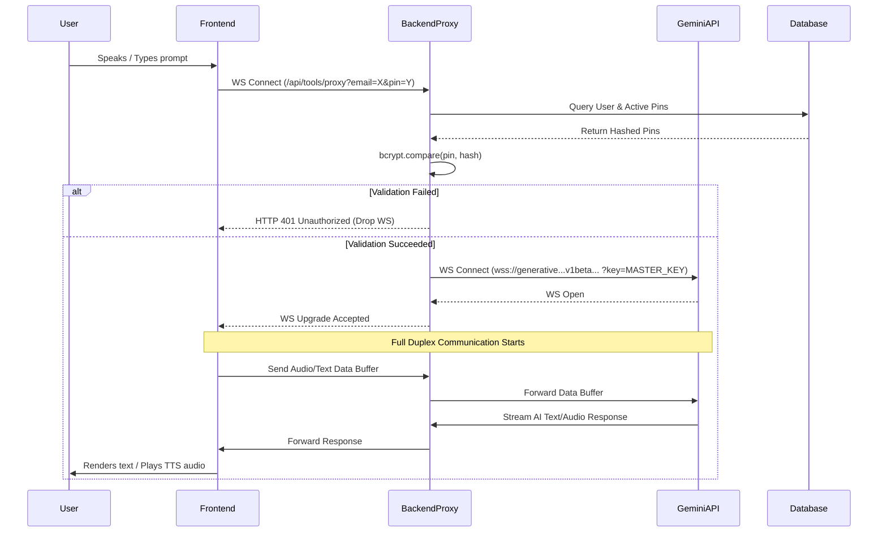

# System Flow

This document details the critical data flows and interaction cycles within the Ternkonnect Digital Accessibility Platform.

## 1. User Registration & Setup Flow

1. **Sign Up**: The user navigates to the frontend application and registers.
2. **Backend Validation**: The frontend sends a `POST /api/auth/register` request. The backend hashes the password and creates a `User` record.
3. **Login**: The user logs in via `POST /api/auth/login`. The backend issues a JWT.
4. **Pin Generation**: To use the AI capabilities, the user must generate an Integration PIN via the dashboard (`POST /api/pin/generate`). The backend generates a secure 6-digit PIN, hashes it, saves the hash to the DB, and shows the plaintext PIN to the user *once*.

## 2. Gemini AI Real-Time WebSocket Flow

This is the primary operational flow of the accessibility platform.

### Breakdown of the WebSocket Exchange:

1. **Authentication Handshake**: The frontend connects via `ws://localhost:9001/api/tools/proxy?email=user@test.com&pin=123456`.
2. **Security Check**: The backend verifies the PIN against the database.
3. **Upstream Connection**: The backend establishes a secure connection to Google Gemini, injecting the highly sensitive `GEMINI_API_KEY`.
4. **Piping**: 
   - `clientWs.on("message")` -> `targetWs.send(message)`
   - `targetWs.on("message")` -> `clientWs.send(message)`
5. **Connection Termination**: If either the client or Gemini closes the connection (`close` or `error` events), the proxy safely tears down the remaining socket to prevent memory leaks.

## 3. Usage Logging Flow

To ensure fair use and billing accuracy:
1. When a user utilizes a tool (or after a WS session completes), the frontend triggers `POST /api/tools/usage`.
2. The backend validates the JWT.
3. A new `UsageLog` record is inserted with the `userId`, `toolId`, and session metadata (e.g., duration, tokens used).
4. (Future Implementation): A cron job checks `UsageLog` against the `Subscription` limits to disable access if limits are exceeded.

## 4. Accessibility Theme Toggle Flow

1. The user clicks the "Toggle Contrast" or "Toggle Font" button in the frontend toolbar.
2. React State updates (`useContext` or `useState` at the root).
3. The root HTML element `className` or `data-theme` attribute changes.
4. CSS Variables (defined in `index.css`) recalculate instantly.
5. Voice notifications trigger via the `useTTS` hook to announce: "High contrast mode enabled."

## 5. Chrome Extension Integration Flow

The Ternkonnect Accessibility Platform can be embedded into third-party browsers via a Chrome Extension.
1. **Installation**: User installs the Ternkonnect Chrome Extension.
2. **Authentication**: 
   - The user clicks the extension icon.
   - The extension prompts for `Email` and `Integration PIN` (generated via the main Ternkonnect dashboard).
   - The extension saves these credentials locally (`chrome.storage.local`).
3. **Accessibility Injection**:
   - The extension injects content scripts into the active tab.
   - It applies custom CSS filters (e.g., contrast overrides) and attaches to DOM elements for screen-reading.
4. **AI Assistant Overlay**:
   - The extension spawns a Floating UI widget.
   - When opened, it connects via WebSocket to the proxy: `wss://api.ternkonnect.com/api/tools/proxy?email=...&pin=...`.
   - The user can highlight text on the third-party page and click "Summarize" within the extension, forwarding the text over the WebSocket to Gemini.

## 6. Widget Integration Flow (Third-Party Websites)

Organizations (like the Main LMS) can embed Ternkonnect's accessibility tools directly into their websites.
1. **Script Embedding**: The third-party website includes the widget loader script: ``.
2. **Initialization**: The script initializes with the Organization's public API key or a specific User's Integration PIN.
3. **DOM Manipulation**: The widget injects accessibility toggles (Contrast, Font size) fixed to the bottom corner of the viewport.
4. **Communication**:
   - The widget establishes an iframe or a Shadow DOM container to prevent CSS bleeding.
   - Chat/Voice interactions map directly to the `api/tools/proxy` endpoint.

## 7. Documentation Processes

For developers integrating with Ternkonnect:
1. **API Reference**: Detailed Swagger/OpenAPI specifications covering REST endpoints (`/api/auth`, `/api/pin`, `/api/stats`).
2. **Integration Guide**: Step-by-step tutorials for integrating the Widget SDK into React/Vue/Vanilla HTML.
3. **Changelogs**: Maintaining a `CHANGELOG.md` file tracking updates to WebSocket protocols and new accessibility features.
4. **Developer Dashboard**: Organizations use `/dashboard/org-admin` to monitor widget usage, generate new API keys, and manage billing for their integrations.

**PHASES**

**PHASE A — Integration (one-time setup)**

new-chrome-extension          Ternkonnect-Digital-Accessibilty-Platform
        |                              |
        |  1. (web dashboard) login -> | POST /api/auth/login
        |                              |   validates User+password -> dashboard JWT (1 day)
        |                              |
        |  2. (web dashboard)          | POST /api/platform/chrome-integration  (auth: dashboard JWT)
        |     "create integration"  -> |   creates ChromeIntegration { userId, integrationCode }
        |                              |
        |  3. install extension,       |
        |     open popup, enter        |
        |     email + integrationCode  |
        |                              |
        |  4. integrate_profile     -> | POST /api/platform/chrome/integrate
        |                              |   checks: User exists, Subscription active,
        |                              |   ChromeIntegration.integrationCode matches
        |                              |   -> marks integration "active", links ChromeProfile
        |  <- {success: true} ---------|
        |                              |
        |  5. stores ternkonnectEmail/ |
        |     ternkonnectCode in       |
        |     chrome.storage.local     |
Integration is done once. From here on, every voice session reuses the stored email + integrationCode.

**PHASE B — Starting a voice session (every time the user starts talking)**

Extension (offscreen.js)   Platform                     digital-accessibility-intelligence   Gemini Live
        |                     |                                    |                              |
   6.   | get_chrome_session_ |                                    |                              |
        | token (via bg.js)   |                                    |                              |
   7.   |-------------------->| POST /api/auth/session              |                              |
        |                     |   {email, integrationCode}          |                              |
   8.   |                     |   re-validates Subscription +       |                              |
        |                     |   ChromeIntegration, signs JWT       |                              |
        |                     |   (JWT_SECRET, scope:"voice_session",|                              |
        |                     |    plan_tier, max_session_seconds,   |                              |
        |                     |    max_concurrent_sessions, 30m TTL) |                              |
   9.   |<--------------------| {token, expiresIn}                  |                              |
        | (cached in background.js until ~60s before expiry)        |                              |
        |                                                           |                              |
  10.   |------------------------ open WebSocket ----------------->|                              |
  11.   |---- {type:"auth", token} --------------------------------->|                              |
  12.   |                                                           | validate_token(): verify     |
        |                                                           | signature w/ same JWT_SECRET,|
        |                                                           | check scope — NO db call     |
  13.   |                                                           | session_manager.acquire():   |
        |                                                           | check per-user + global caps |
        |              (if over capacity: send capacity_exceeded,   |                              |
        |               close — no Gemini cost incurred at all)     |                              |
  14.   |                                                           |---- open WS, send "setup" -->|
        |                                                           |  (system prompt from         |
        |                                                           |   core/prompts.py + 27 tool  |
        |                                                           |   declarations from tools.py)|
  15.   |<---------------------------------- setupComplete ----------------------------------------|
        | (sends "Begin." nudge on first connect -> Gemini speaks the welcome greeting)            |
**PHASE C — Live usage loop (repeats continuously while the session is open)**

Extension                  Intelligence backend                Gemini Live
   |                              |                                 |
16.| mic audio (realtimeInput) -->| relay + track audio_seconds_in  |
   | (skipped while isPlaying —   |-------------------------------->|
   |  half-duplex, avoids echo)   |                                 |
   |                              |                          18. Gemini does STT + reasoning,
   |                              |                              decides to act
   |                              |<----------- toolCall -----------|
19.|                       19. intercept: tool_call_count++,         |
   |                           send feedback_sound "tick",          |
   |                           log (redacted), relay unmodified      |
   |<---- toolCall ---------------|                                 |
20.| forward to background.js -> chrome.scripting.executeScript     |
21.| background.js runs the real DOM action (click/type/scroll/     |
   | shadow-DOM-aware element find / dismiss_overlay / etc.)        |
   | <- {success / error} result                                    |
22.| toolResponse ---------------->| 23. intercept: success/fail ->  |
   |                              |     feedback_sound, retry-count  |
   |                              |     tracking (3 fails in a row   |
   |                              |     on the same tool ->          |
   |                              |     action_failed_final)         |
   |                              |---------- toolResponse --------->|
   |                              |                          24. Gemini continues, eventually
   |                              |                              emits TTS audio / text
   |<------------------- serverContent (audio/text) ------------------|
25.| play TTS audio -> isPlaying=true (mutes mic send until drained) |
26.|                              | (>8s reasoning gap with no output
   |<---- thinking_filler --------|  -> filler sent, logged client-side)
   |                              |                                 |
   `-------------------------- loop repeats ---------------------------`
**PHASE D — Token refresh, idle/duration limits, teardown**

~25 min in:  offscreen.js force-refreshes the token (same Phase B call to
             /api/auth/session) and sends {type:"reauth", token} over the
             SAME open socket -> Intelligence backend swaps in new claims,
             Gemini session is never interrupted.

Idle/duration watchdog (Intelligence backend): no activity for
IDLE_DISCONNECT_SECONDS, or duration >= min(token.max_session_seconds,
MAX_SESSION_DURATION_SECONDS) -> cancels all tasks, closes Gemini WS + client WS.

On shutdown (clean close, idle timeout, duration cap, or crash) AND every
USAGE_REPORT_INTERVAL_SECONDS during long sessions:
  Intelligence backend --POST /api/usage/report--> Platform
    (X-Service-Key: INTELLIGENCE_SERVICE_KEY, NOT the user's JWT)
    {user_id, integration_id, duration_seconds delta, tool_call_count delta, audio_seconds delta}
  Platform writes a UsageLog row.

Extension's service-worker sees the WS close -> reconnects after 5s backoff,
unless the close was caused by auth_failed (suppressNextReconnect=true).

Trial mode is a separate, simpler branch: no Platform account exists yet, so there's nothing to mint a JWT for. The extension connects straight to the Platform's pre-existing raw proxy (/api/tools/proxy?trial=true), which just forwards bytes directly to Gemini — no auth, no server-side prompt injection, no capacity/usage tracking. It bypasses digital-accessibility-intelligence entirely; only authenticated, subscribed sessions go through the new system.