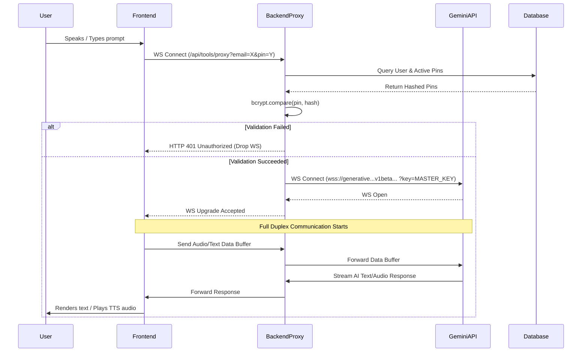

# System Flow

This document details the critical data flows and interaction cycles within the Ternkonnect Digital Accessibility Platform.

## 1. User Registration & Setup Flow

1. **Sign Up**: The user navigates to the frontend application and registers.
2. **Backend Validation**: The frontend sends a `POST /api/auth/register` request. The backend hashes the password and creates a `User` record.
3. **Login**: The user logs in via `POST /api/auth/login`. The backend issues a JWT.
4. **Pin Generation**: To use the AI capabilities, the user must generate an Integration PIN via the dashboard (`POST /api/pin/generate`). The backend generates a secure 6-digit PIN, hashes it, saves the hash to the DB, and shows the plaintext PIN to the user *once*.

## 2. Gemini AI Real-Time WebSocket Flow

This is the primary operational flow of the accessibility platform.

### Breakdown of the WebSocket Exchange:

1. **Authentication Handshake**: The frontend connects via `ws://localhost:9001/api/tools/proxy?email=user@test.com&pin=123456`.
2. **Security Check**: The backend verifies the PIN against the database.
3. **Upstream Connection**: The backend establishes a secure connection to Google Gemini, injecting the highly sensitive `GEMINI_API_KEY`.
4. **Piping**: 
   - `clientWs.on("message")` -> `targetWs.send(message)`
   - `targetWs.on("message")` -> `clientWs.send(message)`
5. **Connection Termination**: If either the client or Gemini closes the connection (`close` or `error` events), the proxy safely tears down the remaining socket to prevent memory leaks.

## 3. Usage Logging Flow

To ensure fair use and billing accuracy:
1. When a user utilizes a tool (or after a WS session completes), the frontend triggers `POST /api/tools/usage`.
2. The backend validates the JWT.
3. A new `UsageLog` record is inserted with the `userId`, `toolId`, and session metadata (e.g., duration, tokens used).
4. (Future Implementation): A cron job checks `UsageLog` against the `Subscription` limits to disable access if limits are exceeded.

## 4. Accessibility Theme Toggle Flow

1. The user clicks the "Toggle Contrast" or "Toggle Font" button in the frontend toolbar.
2. React State updates (`useContext` or `useState` at the root).
3. The root HTML element `className` or `data-theme` attribute changes.
4. CSS Variables (defined in `index.css`) recalculate instantly.
5. Voice notifications trigger via the `useTTS` hook to announce: "High contrast mode enabled."

## 5. Chrome Extension Integration Flow

The Ternkonnect Accessibility Platform can be embedded into third-party browsers via a Chrome Extension.
1. **Installation**: User installs the Ternkonnect Chrome Extension.
2. **Authentication**: 
   - The user clicks the extension icon.
   - The extension prompts for `Email` and `Integration PIN` (generated via the main Ternkonnect dashboard).
   - The extension saves these credentials locally (`chrome.storage.local`).
3. **Accessibility Injection**:
   - The extension injects content scripts into the active tab.
   - It applies custom CSS filters (e.g., contrast overrides) and attaches to DOM elements for screen-reading.
4. **AI Assistant Overlay**:
   - The extension spawns a Floating UI widget.
   - When opened, it connects via WebSocket to the proxy: `wss://api.ternkonnect.com/api/tools/proxy?email=...&pin=...`.
   - The user can highlight text on the third-party page and click "Summarize" within the extension, forwarding the text over the WebSocket to Gemini.

## 6. Widget Integration Flow (Third-Party Websites)

Organizations (like the Main LMS) can embed Ternkonnect's accessibility tools directly into their websites.
1. **Script Embedding**: The third-party website includes the widget loader script: ``.
2. **Initialization**: The script initializes with the Organization's public API key or a specific User's Integration PIN.
3. **DOM Manipulation**: The widget injects accessibility toggles (Contrast, Font size) fixed to the bottom corner of the viewport.
4. **Communication**:
   - The widget establishes an iframe or a Shadow DOM container to prevent CSS bleeding.
   - Chat/Voice interactions map directly to the `api/tools/proxy` endpoint.

## 7. Documentation Processes

For developers integrating with Ternkonnect:
1. **API Reference**: Detailed Swagger/OpenAPI specifications covering REST endpoints (`/api/auth`, `/api/pin`, `/api/stats`).
2. **Integration Guide**: Step-by-step tutorials for integrating the Widget SDK into React/Vue/Vanilla HTML.
3. **Changelogs**: Maintaining a `CHANGELOG.md` file tracking updates to WebSocket protocols and new accessibility features.
4. **Developer Dashboard**: Organizations use `/dashboard/org-admin` to monitor widget usage, generate new API keys, and manage billing for their integrations.
